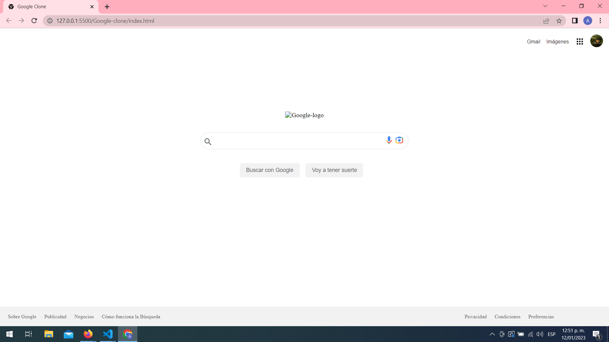

# Ejercicios sin objetivo especifico.

Hola, he creado este repositorio para llevar un seguimiento a los pequeños ejercicios practicos que he realizado.
Han pasado una serie de eventos desafortunados pero he seguido en este camino, me he sentido muy triste por no poder estar con mi hija el teimpo que quisiera, 
sin embargo sigo adelante en este proyecto de vida.

## Objetivos del repositorio:
* Crear una base de "moldes" para poder usar en proyectos posteriores.
* Aprender a usar lo básico para poder comunicarme, no debo olvidar que este es el medio para un fin. 
## Google-clone:
# El logo dejo de funcionar, asi que mi proyecto se ve asi :

